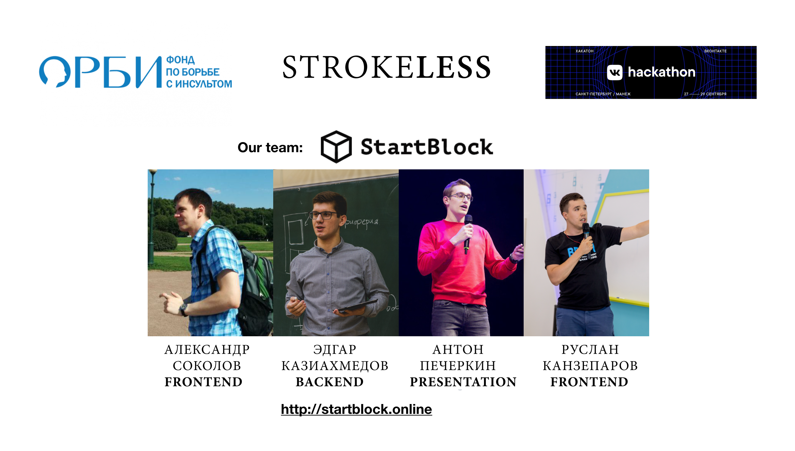
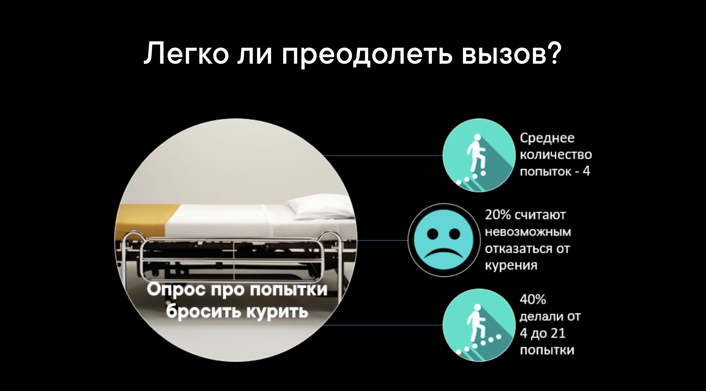
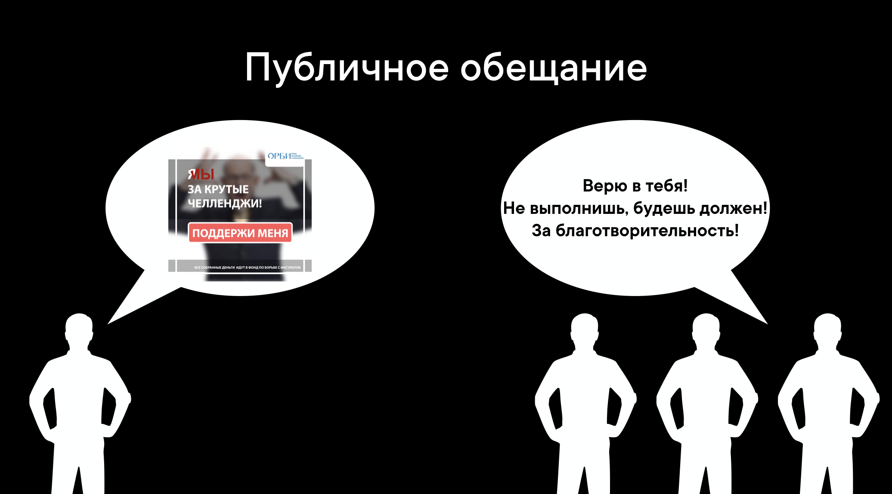
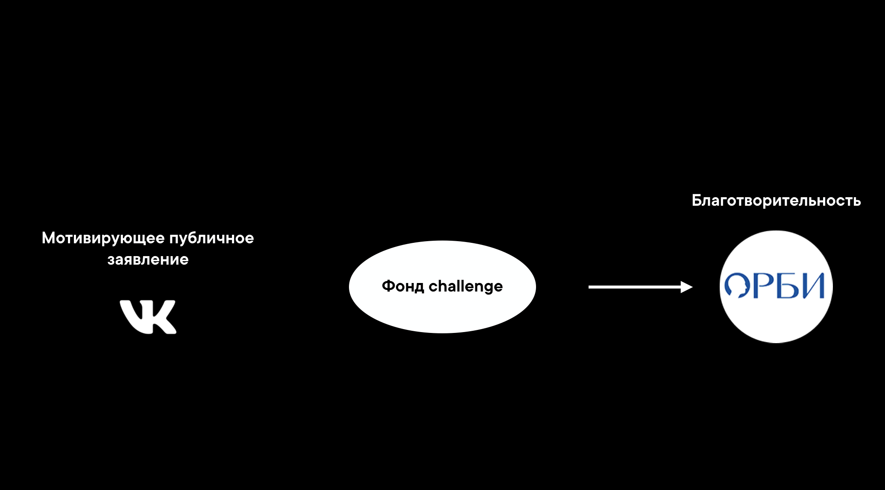
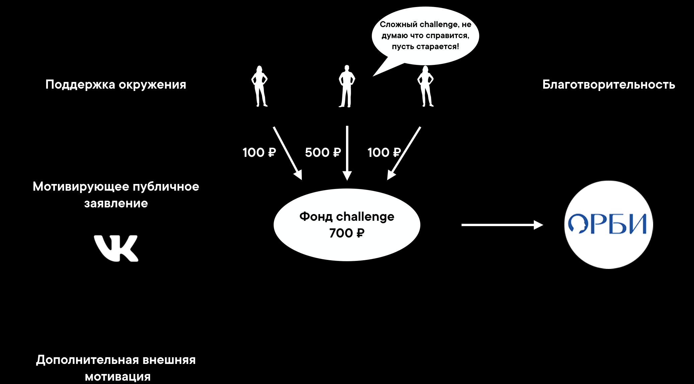
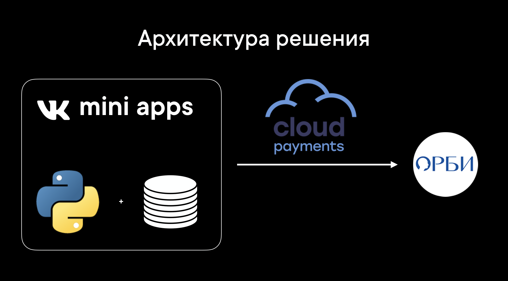
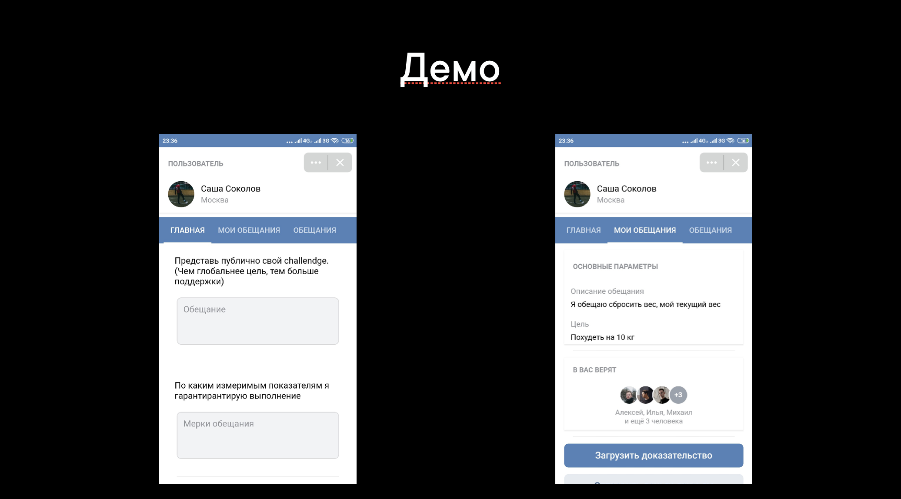

# VKHack2019
VKHackathon 2019 in Saint Petersburg ♥

# STROKELESS

# Структура

<ol type="1" style="font-size: x-large;">
<li> <a href="https://github.com/kanzeparov/VKHack2019#проблема">Проблема</a>
<li> <a href="https://github.com/kanzeparov/VKHack2019#решение">Решение</a>
<li> <a href="https://github.com/kanzeparov/VKHack2019#механика">Механика</a>
<li> <a href="https://github.com/kanzeparov/VKHack2019#техническая-архитектура">Техническая архитектура</a>
<li> <a href="https://github.com/kanzeparov/VKHack2019#демо">Демо</a>
<li> <a href="https://github.com/kanzeparov/VKHack2019#установка">Установка</a>  
<li> <a href="https://github.com/kanzeparov/VKHack2019#решение">Команда</a>
</ol>

# Проблема

Все мы сталкиваемся с вызовами, которые можем преодолеть или сдаться.

В том числе в охране своего здоровья. 

Однако часто очень сложно контролировать эту область когда возникает очень много других "более важных" задач. 

По данным исследования по борьбе с курением мы видем очень печальные результаты.

# Решение

Как же еще можно мотивировать себя на выполнение собственных вызовов для улучшения здоровья?

Публичные обещания. Когда я публично дал слово, я обязан его выполнить.

В своем решении мы предлагаем сосредоточиться на сильнейшей внешней мотивации - публичное обещание и доказательство выполнения его в срок.

# Механика

Как же работает наш механизм?

Мы формируем мотивирующий нас вызов и публично заявляем его среди друзей в социальной сети ВКонтакте.

Четко указываем критерии выполнения, свои доказательства, срок.

Приглашаем друзей отслеживать прогресс по данному обещанию, а также поддержать пожертвованием в фонд борьбы с инсультом. Что будет только сильнее мотивировать выполнить благотворительную обязанность.

 

Кроме того я обещаю выполнить в срок данное обещание, иначе буду обязан друзьям вернуть все деньги, которыми они поверили в меня и внесли в благотворительность.

Материальное обязательство перед друзьями еще сильнее мотивирует меня не сдаваться. 

При этом размер обязательства регулируют все люди вносящие пожертвования.

 
# Техническая архитектура

Наше решение реализовано в качестве VK mini app. 

Серверная часть реализована на Python Django.

Для осуществления реальных пожертвований в фонд ОРБИ реализована интеграция с системой cloudpayments прямо внутри приложения.

 

# Демо

 

# Установка

запуск БД:

cd backend/

Очистка кеша Django

1. rm -rf ./webreceiver/migrations/

Создание пользователья и базы данных

2. sudo -u postgres psql -f ./create_db.sql

Создание таблиц, описанных в models.py

3. python ./manage.py makemigrations webreceiver

4. python ./manage.py migrate webreceiver

5. python ./manage.py migrate

Запуск базы данных

6. python ./manage.py runserver 0.0.0.0:8080

запуск VK mini apps:

1. npm install

2. npm start

# Команда

