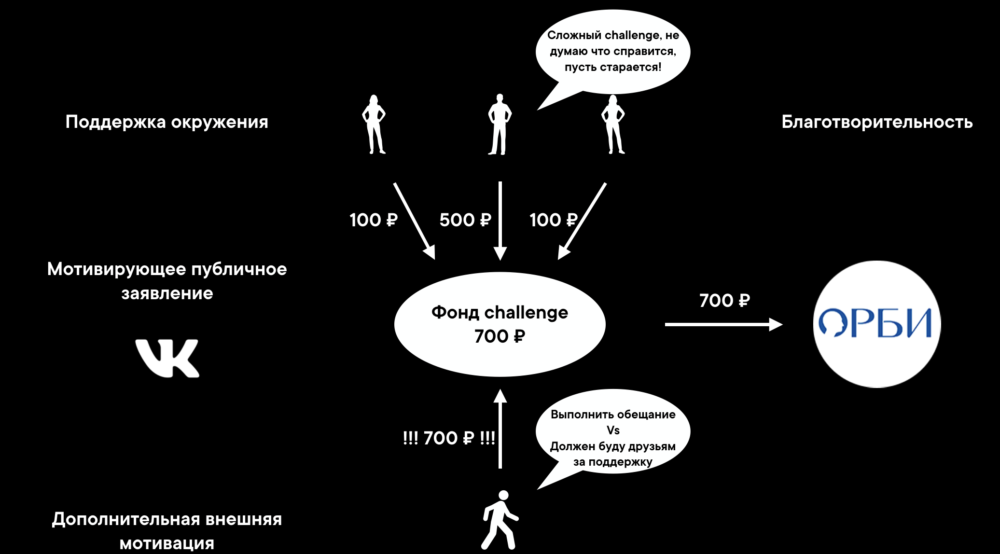

# VKHack2019
VKHackathon 2019 in Saint Petersburg ♥

# STROKELESS

# Структура

<ol type="1" style="font-size: x-large;">
<li> <a href="https://github.com/kanzeparov/VKHack2019#проблема">Проблема</a>
<li> <a href="https://github.com/kanzeparov/VKHack2019#решение">Решение</a>
<li> <a href="https://github.com/kanzeparov/VKHack2019#механика">Механика</a>
<li> <a href="https://github.com/kanzeparov/VKHack2019#техническая-архитектура">Техническая архитектура</a>
<li> <a href="https://github.com/kanzeparov/VKHack2019#демо">Демо</a>
<li> <a href="https://github.com/kanzeparov/VKHack2019#установка">Установка</a>  
<li> <a href="https://github.com/kanzeparov/VKHack2019#решение">Команда</a>
</ol>

# Проблема

# Решение

# Механика

 

# Техническая архитектура

 

# Демо

 

# Установка

запуск БД:
cd backend/
Очистка кеша Django
1. rm -rf ./webreceiver/migrations/
Создание пользователья и базы данных
2. sudo -u postgres psql -f ./create_db.sql
Создание таблиц, описанных в models.py
3. python ./manage.py makemigrations webreceiver
4. python ./manage.py migrate webreceiver
5. python ./manage.py migrate
Запуск базы данных
6. python ./manage.py runserver 0.0.0.0:8080

запуск VK mini apps:
1. npm install
2. npm start

# Команда

